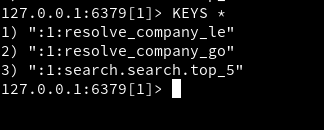
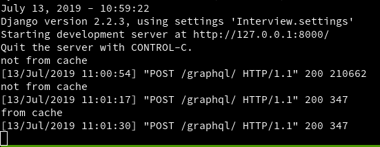
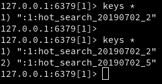
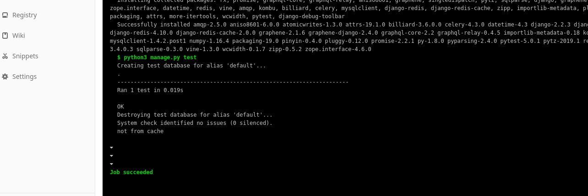

时间仓促，这里记录一些可以优化的点：

### 搜索的时候，搜「le」可以搜到「咕果科技」

「咕果科技」由于其 slug 为「google」，包含了 「le」，需要优化。

### 大量的针对某个公司的搜索可以刷排名

用户发现了 GraphQL 接口与热搜之间的联系后疯狂刷几个公司的搜索，需要优化。

### 大量的查询会给数据库造成很大的压力

嗯，由于针对三个可能的列（`name`，`slug `和 `pinyin`）进行的查询，所以每次查询都会对数据库造成压力，需要优化，可能的优化点在于：

* 数据库索引的建立和优化

* 将每次查询的结构丢到 redis 中，并设置一个超时时间（比如 15 分钟），在之后的查询如果 redis 中有缓存数据的话就直接取，如果没有则回源到 MySQL 上。

  > 已经建立完成，对于每一次搜索，都会生成一个 `resolve_company_$query` ，例如 `resolve_company_le` 是针对 `le` 这个搜索建立的变量名，会针对这个搜索结果进行缓存（到 redis 的 1），超时时间为 15 分钟，默认优先找缓存，如果不存在才会回源+设置缓存。
  >
  > 
  >
  > 对于热搜公司而言，也会建立对应的缓存，称为 `hot_search_$week_$count`，例如对于 20190702（2019 年 7 月第 2 周）的前 5 热搜公司会被称为 `hot_search_20190702_5` ，默认优先找缓存，如果不存在才会回源+设置缓存。
  >
  > 
  >
  > 

### 更新数据对数据库造成的压力

与查询类似，由于我们需要加入每次搜索的统计，所以根据一个 naïve 的逻辑的话，如下：

* 用户搜索
* 将返回的搜索结果中所有公司的被搜索次数 +1

这样的话每次搜索就会给数据库造成很大的压力，毕竟又是读又是写的，虽然上面的 redis 缓存可以减轻读的压力，我们还是可以优化一下，将写的压力降低，思路如下：

* 每次搜索后将修改数据库的操作放在 Celery 的 task 中进行，让 Celery 来顺序执行以减轻对于数据库的压力。**（已完成）**
* 后期可能的话甚至可以设置为定期执行（比如每小时，或者每天凌晨统一执行一遍，类似目前 rank 的操作，参考 LeetCode 员工 xidui 对于 ranklist 的描述——[一个隐藏在黑客迷雾下的bug——记一次黑客攻防 | xidui is very lazy](https://xidui.github.io/2017/03/29/%E4%B8%80%E4%B8%AA%E8%97%8F%E5%8C%BF%E5%9C%A8%E9%BB%91%E5%AE%A2%E8%BF%B7%E9%9B%BE%E4%B8%8B%E7%9A%84bug/)）

### GitLab CI 对于 MySQL 支持不好

暂时没有时间去自己做一个 MySQL 镜像，如果使用官方的 MySQL 似乎无法手动导入 `my.cnf` 文件，就会遇到中文问题，暂时使用 SQLite 作为 CI 测试使用。

